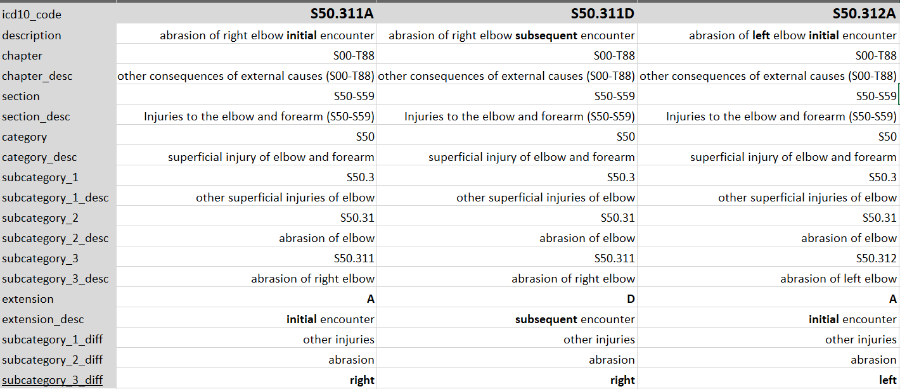

# ICD10_codes

This repo uses ICD10 xml files from [CMS](cms.gov) (Centers for Medicare & Medicaid Services), to parse the ICD10 codes as a hierarchy. For example the diagnosis codes have similarites at each level of additional characters.

* The hierarchy csvs are [here](output). They are listed by year.
* [This R file](R/roll_up_codes.R) will roll-up diagnosis codes to a certain sample size.This helps see the bigger picture when the diagnosis codes are too granular.
* The files to parse and generate the CSVs are [here](R)

